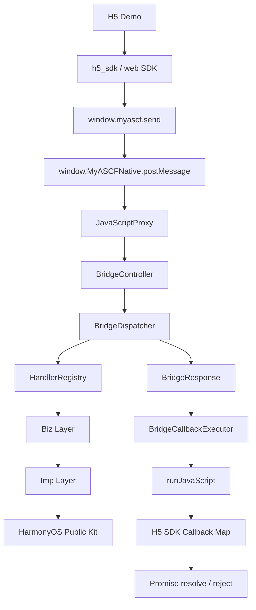
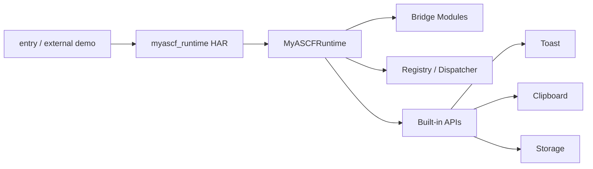
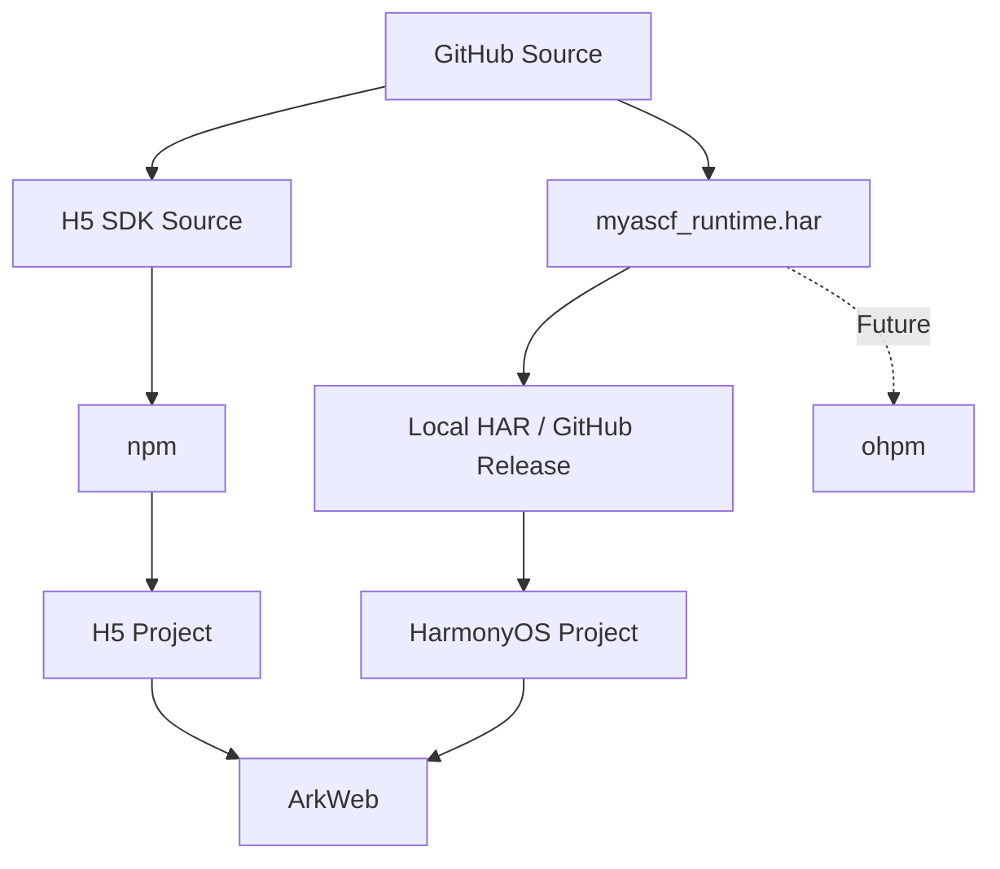
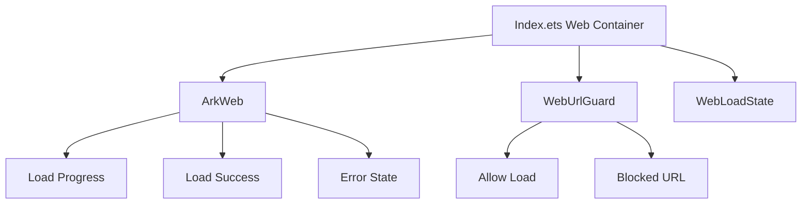
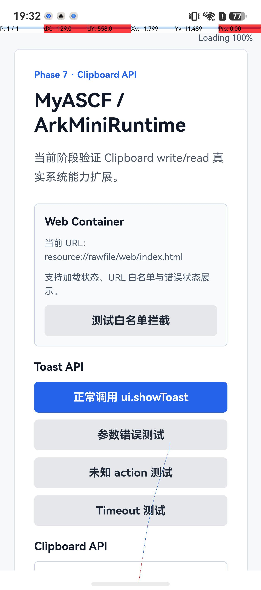
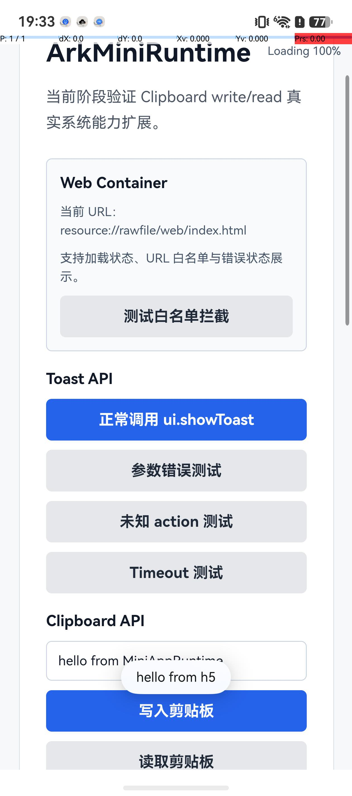
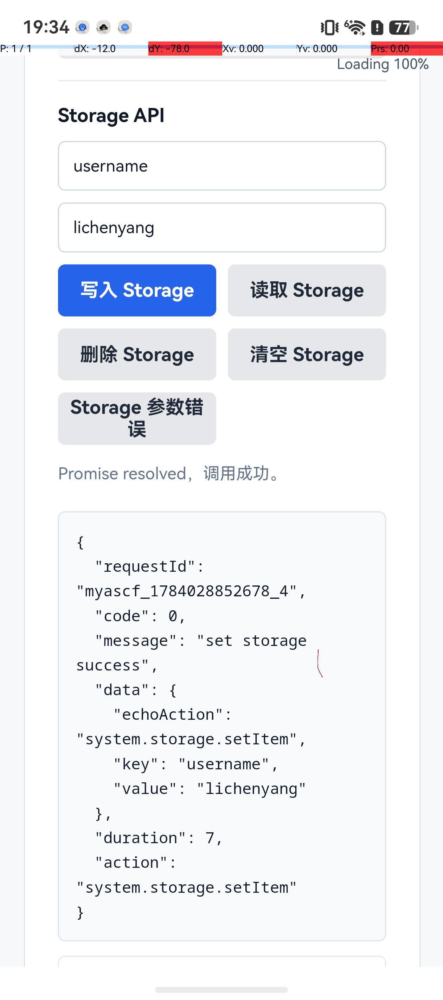
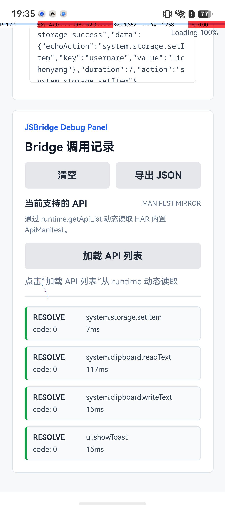
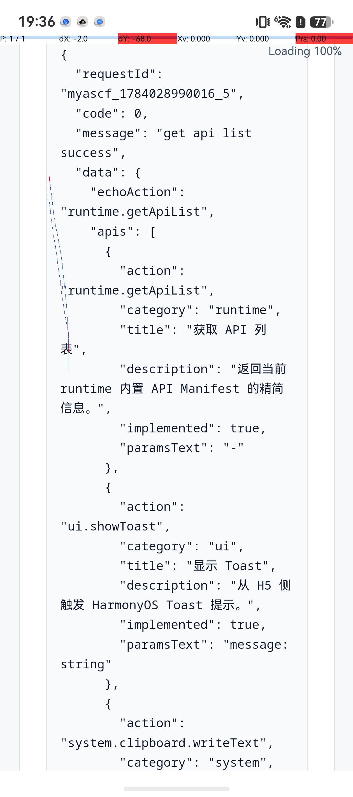
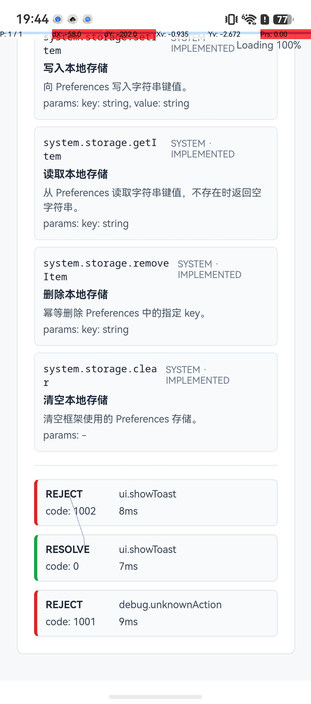

# MiniAppRuntime-Harmony


MiniAppRuntime-Harmony 是一个基于 HarmonyOS、ArkTS 和 ArkWeb 公开能力实现的轻量级 Web 容器与 JSBridge 框架。项目通过 ArkTS HAR Runtime 与可复用 H5 SDK，实现 H5 请求进入 ArkTS 并回到 Promise 的工程链路。

项目受小程序运行时架构启发，重点探索通信、分发、注册、参数校验、平台调用、异步回调和工程化验证如何形成清晰边界。

## 合规边界

本项目为个人开源学习与工程实践项目，完全基于公开 HarmonyOS、ArkTS 与 ArkWeb 能力实现。公开仓库仅包含自行编写的项目代码、示例和文档，不包含任何非公开实现或业务材料。

## 当前能力

- ArkWeb 加载本地 H5，展示加载进度和加载状态。
- `window.myascf.send(action, params, options?)` Promise 调用方式。
- requestId、callback map、TIMEOUT 与 CALLBACK_LOST。
- JavaScriptProxy 与 runJavaScript 双向通信。
- BridgeController、BridgeDispatcher、HandlerRegistry、RuntimeBootstrap。
- Biz / Imp 分层与 BridgeCallbackExecutor 统一回调。
- UNKNOWN_ACTION、PARAM_ERROR、INTERNAL_ERROR、PARSE_ERROR 等错误处理。
- Toast、Clipboard、Storage 和 `network.request` API。
- `network.request` 支持 AbortController、并发 active registry 与取消后晚到响应抑制。
- H5 DebugPanel 调用链路展示。
- `myascf_runtime` 本地 HAR 模块与 `MyASCFRuntime` 门面类。
- WebLoadState、URL Guard、白名单判断和错误状态页。
- API Manifest 与 `runtime.getApiList` 动态能力查询。
- `h5_sdk` 可复用前端 SDK、TypeScript 源码与类型声明。
- NATIVE_UNAVAILABLE、INVALID_RESPONSE 等 H5 侧错误治理。

## Quick Links

- [Quick Start](#quick-start)
- [Runtime Architecture](docs/architecture/runtime-architecture.md)
- [Demo Walkthrough](docs/showcase/demo-walkthrough.md)
- [Documentation](docs/README.md)
- [v0.1.0 Release Notes](docs/release/v0.1.0-release-notes.md)
- [Candidate Checklist](docs/release/v0.1.0-checklist.md)
- [Article Draft](docs/articles/juejin-h5-sdk-runtime-framework-design.md)

## Architecture









## 核心调用链

```text
H5 -> window.myascf.send -> JavaScriptProxy -> BridgeController
   -> BridgeDispatcher -> HandlerRegistry -> Biz -> Imp
   -> BridgeResponse -> BridgeCallbackExecutor -> runJavaScript
   -> H5 callback map -> Promise resolve / reject
```

新增 API 不需要修改 BridgeController 主链路，只需定义 action、实现 Biz/Imp，并在 RuntimeBootstrap 注册 handler。

## Packages

| Package | Type | Status | Usage |
| --- | --- | --- | --- |
| `entry` | HarmonyOS demo app | demo ready | run in DevEco Studio |
| `myascf_runtime` | HarmonyOS local HAR | local HAR ready (`1.0.0` module metadata) | `file:../myascf_runtime` |
| `h5_sdk` | H5 JavaScript / TypeScript SDK | IIFE / ESM / npm pack ready (`0.1.0`) | script or ESM import |

`myascf_runtime` 负责 Native Bridge、分发注册、Biz/Imp、回调、Manifest 和容器公共模型；`h5_sdk` 负责 `window.myascf`、requestId、callback map、timeout 和 Native response；`entry` 负责 ArkWeb、JavaScriptProxy 注入、H5 Demo 与 DebugPanel。HAR 使用 `1.0.0` 是为了满足当前 Hvigor 的模块版本校验，不表示它已正式发布。

## Release Status

Current candidate version: `v0.1.0`.

项目当前按 GitHub 开源展示版整理。H5 SDK `@lcy453/miniapp-runtime-harmony-web-sdk@0.1.0` 已发布到 npm 并完成 registry 消费验证；ArkTS runtime 当前只提供本地 HAR 和 GitHub 示例接入，不声称已经发布到 HarmonyOS 包仓库。

安装：

```bash
npm install @lcy453/miniapp-runtime-harmony-web-sdk@0.1.0
```

```ts
import { initMyASCF, createTypedApi } from '@lcy453/miniapp-runtime-harmony-web-sdk';
```

npm 包状态以官方 registry 回读结果为准；HAR 仍保持本地构建与复制接入。

`9de3f82` 的 [GitHub Actions CI](https://github.com/lichenyang5/MiniAppRuntime-Harmony/actions/runs/29386035145) 已通过，但 `v0.1.0` 尚未创建 tag 或 GitHub Release。远端历史中的签名凭据必须先轮换或吊销并完成清理，这是发布阻塞项。详情见 [Release Preparation](RELEASE.md)、[v0.1.0 Release Notes](docs/release/v0.1.0-release-notes.md)、[Publish Record](docs/release/v0.1.0-publish-record.md) 和 [候选验收清单](docs/release/v0.1.0-checklist.md)。

## H5 SDK 类型化调用

```ts
import { createTypedApi, initMyASCF } from '@lcy453/miniapp-runtime-harmony-web-sdk';

const client = initMyASCF();
const api = createTypedApi(client);

await api.ui.showToast({ message: 'hello' });
const item = await api.system.storage.getItem({ key: 'username' });
console.log(item.data?.value);
```

`ApiAction`、参数 Map、响应 Map 和 nested helper 由 `tools/api-manifest.json` 生成。执行 `npm run sdk:types` 只生成 SDK 类型，执行 `npm run generate` 同时刷新 API 文档与 SDK 类型。底层仍使用现有 `send` 与 JSBridge 协议。

## H5 SDK npm Pack 预检

H5 SDK 已完成 IIFE + ESM 双产物、本地 dry-run、tarball、外部 ESM consumer 和 npm registry 消费验证，并已发布为 `@lcy453/miniapp-runtime-harmony-web-sdk@0.1.0`。

```bash
cd h5_sdk
npm run pack:check
npm run pack:local
```

生成的 `lcy453-miniapp-runtime-harmony-web-sdk-0.1.0.tgz` 只用于本地验证并由 Git 忽略。`npm pack` 检查包内容，和把包上传到 registry 的 `npm publish` 是两件事。完整步骤见 [npm pack 验证](docs/release/npm-pack-verify.md)。

## CI / Quality

```bash
npm run check
npm --prefix h5_sdk run check
```

自动检查覆盖 H5 SDK IIFE/ESM 构建与单元测试、API Manifest 和 ArkTS 注册关系、生成 API 文档、typed API 类型、package exports 与 npm pack dry-run。HarmonyOS ArkWeb、Native API、权限和设备行为仍需结合 DevEco Studio 执行 [手工 smoke test](docs/testing/manual-smoke-test.md)。

仓库已配置 GitHub Actions，在 push 到 `main`/`master` 和 pull request 时运行生成物检查、Manifest 一致性、H5 SDK build/test、package exports 与 npm pack dry-run。配置推送后可在 Actions 页面查看真实结果；CI 通过不等同于 HarmonyOS 真机链路通过。

测试说明与发布回归入口见 [docs/testing](docs/testing/README.md)，workflow 边界见 [CI 文档](docs/ci/README.md)。

## Local HAR

`entry` 是可运行示例，负责 ArkWeb、H5 Demo 和容器 UI；`myascf_runtime` 是本地 HAR，负责 JSBridge 主链路、API 注册、平台能力封装和容器公共模型。`MyASCFRuntime` 在 HAR 内组装 Registry、Dispatcher、CallbackExecutor、Controller 和 Native Proxy。

三种使用模式必须区分：仓库内 `entry` 通过 `file:../myascf_runtime` 做源码联调；外部 HarmonyOS 工程通过 `entry/libs/myascf_runtime.har` 消费 HAR；H5 工程通过 npm 安装 SDK。完整的 npm + HAR 独立示例位于 [`examples/npm-har-consumer-demo`](examples/npm-har-consumer-demo/README.md)。

## Quick Start

1. 使用 DevEco Studio 打开仓库根目录 `ArkMiniRuntime`，执行 ohpm 依赖同步。`entry` 通过 `file:../myascf_runtime` 使用本地 HAR。
2. 首次安装 H5 SDK 依赖：

```bash
npm --prefix h5_sdk install
```

3. 构建 H5 SDK，并把 IIFE 产物同步到 entry rawfile。下面两种写法等价：

```bash
npm run h5:sync
# 或
npm --prefix h5_sdk run build
npm --prefix h5_sdk run copy:demo
```

4. 在 DevEco Studio 中 Sync Project，随后 Clean、Rebuild `entry`，在模拟器或真机运行 Demo。
5. 验证 Toast、Clipboard、Storage、`runtime.getApiList`、DebugPanel 和 Web 容器状态。
6. 运行本地质量门禁与包内容预检：

```bash
npm run check
npm --prefix h5_sdk run check
npm --prefix h5_sdk run pack:dry-run
```

建议使用与工程配置匹配的 HarmonyOS SDK。Clipboard 读取能力需要根据当前 SDK 要求配置和验证权限。

本地 HAR 通过 `file:../myascf_runtime` 接入；完整接入见 [HAR 使用指南](docs/guide/har-usage.md)。H5 SDK 的 IIFE、ESM 与 typed API 用法分别见 [H5 SDK 指南](docs/guide/h5-sdk-usage.md) 和 [Typed API](docs/guide/typed-api-usage.md)。

## Demo Path

推荐按“启动容器 -> Toast -> Clipboard -> Storage -> API List -> DebugPanel -> 错误场景 -> URL Guard”的顺序演示。逐步操作、预期结果和排查入口见 [Demo Walkthrough](docs/showcase/demo-walkthrough.md)。

## MyASCFRuntime 接入

`entry/oh-package.json5`：

```json5
{
  "dependencies": {
    "myascf_runtime": "file:../myascf_runtime"
  }
}
```

页面接入：

```ts
import { webview } from '@kit.ArkWeb';
import { MyASCFRuntime } from 'myascf_runtime';

@Entry
@Component
struct Index {
  private controller: webview.WebviewController = new webview.WebviewController();
  private runtime: MyASCFRuntime = new MyASCFRuntime(this.controller, getContext(this));

  build() {
    Column() {
      Web({ src: $rawfile('web/index.html'), controller: this.controller })
        .javaScriptProxy({
          object: this.runtime.getNativeProxy(),
          name: this.runtime.getProxyName(),
          methodList: this.runtime.getMethodList(),
          controller: this.controller
        })
        .width('100%')
        .height('100%')
    }
    .width('100%')
    .height('100%')
  }
}
```

Storage 使用 Preferences，因此当前构造函数需要 Context。完整接入步骤见 [新建 Demo 接入 HAR](docs/guide/create-demo-with-har.md)。

## 当前支持的 API

> API 表格由 `tools/api-manifest.json` 生成。运行：`npm run docs:api` 或 `node tools/generate-api-docs.js`。

<!-- API_TABLE_START -->
| Category | Action | Params | Response | Status |
| --- | --- | --- | --- | --- |
| runtime | `runtime.getApiList` | - | `apis: ApiSummary[]` | ✅ |
| ui | `ui.showToast` | `message: string` | `echoAction: string` | ✅ |
| system | `system.clipboard.writeText` | `text: string` | `echoAction: string` | ✅ |
| system | `system.clipboard.readText` | - | `echoAction: string, text: string` | ✅ |
| system | `system.storage.setItem` | `key: string, value: string` | `echoAction: string, key: string, value: string` | ✅ |
| system | `system.storage.getItem` | `key: string` | `echoAction: string, key: string, value: string` | ✅ |
| system | `system.storage.removeItem` | `key: string` | `echoAction: string, key: string` | ✅ |
| system | `system.storage.clear` | - | `echoAction: string` | ✅ |
| network | `network.request` | `url: string, method?: NetworkMethod, headers?: NetworkHeaders, body?: string, timeout?: number, responseType?: NetworkResponseType` | `ok: boolean, statusCode: number, statusText?: string, headers: NetworkHeaders, body: NetworkBody, duration: number` | ✅ |
<!-- API_TABLE_END -->

完整元信息由 HAR 内的 `BUILTIN_API_MANIFEST` 维护，文档入口见 [API 总览](docs/api/index.md)。

DebugPanel 通过 `runtime.getApiList` 动态读取该清单，不再维护单独的静态 action 列表。

```js
await window.myascf.send('ui.showToast', { message: 'hello from h5' });
await window.myascf.send('network.request', {
  url: 'https://example.com/api/user',
  method: 'GET',
  timeout: 10000,
  responseType: 'json'
}, { timeout: 12000 });
await window.myascf.send('system.clipboard.writeText', { text: 'hello clipboard' });
const storageRes = await window.myascf.send('system.storage.getItem', { key: 'username' });
```

`network.request` 采用类似 Fetch 的 HTTP 状态语义：只要 Runtime 收到有效 HTTP 响应，200、404 和 500 都会 resolve。`data.ok` 仅在 2xx 时为 `true`，`data.statusCode` 始终保留真实状态；POST 返回 404 通常表示目标服务没有对应 POST 路由，不代表 Bridge 调用失败。

```ts
const controller = new AbortController();
const task = api.network.request({ url: 'https://example.com/slow' }, {
  timeout: 12000,
  signal: controller.signal
});
controller.abort();
await task; // rejects AbortError with code ABORTED
```

SDK 取消后会清理 callback、timer 和 listener，并通过 internal `network.abort` 请求 Runtime 使用公开 `HttpRequest.destroy()` 做 best-effort 终止。`network.abort` 不出现在 typed API 或 `runtime.getApiList` 中。

## Web Container

示例应用通过 ArkWeb 事件维护 `idle / loading / success / error / blocked` 状态，展示加载进度，在主页面失败或 URL 被拦截时显示可重试的错误状态。`WebUrlGuard` 当前提供轻量 scheme 与 host 白名单判断，不等同于完整安全沙箱。

## Project Structure

```text
entry/                         可运行 Demo、ArkWeb、rawfile H5
h5_sdk/                        可复用 H5 JSBridge SDK
  src/                         TypeScript 源码与协议类型
  dist/                        IIFE、ESM 和 d.ts 构建产物
  scripts/                     rawfile 同步脚本
myascf_runtime/                本地 HAR 框架模块
  src/main/ets/bridge/         通信入口与回调执行
  src/main/ets/dispatcher/     action 分发
  src/main/ets/registry/       handler 注册
  src/main/ets/biz/            参数校验与响应语义
  src/main/ets/imp/            HarmonyOS 公开能力调用
  src/main/ets/container/      Web 容器配置、Guard、状态
docs/                          架构、指南、API、调试、阶段与博客
```

## Documentation

- [文档首页](docs/README.md)
- [Quick Start](docs/guide/quick-start.md)
- [npm + HAR 独立 Demo](docs/guide/npm-sdk-har-demo.md)
- [HAR Runtime 接入](docs/guide/har-runtime-usage.md)
- [故障排查](docs/troubleshooting.md)
- [版本兼容矩阵](docs/version-compatibility.md)
- [项目介绍](docs/overview/project-introduction.md)
- [运行时架构](docs/architecture/runtime-architecture.md)
- [JSBridge 架构](docs/architecture/jsbridge-architecture.md)
- [API 总览](docs/api/index.md)
- [HAR 模块设计](docs/architecture/har-module-design.md)
- [Web 容器设计](docs/architecture/web-container-design.md)
- [HAR 使用指南](docs/guide/har-usage.md)
- [新建 Demo 接入](docs/guide/create-demo-with-har.md)
- [调试指南](docs/debug/debug-guide.md)
- [API Manifest 设计](docs/architecture/api-manifest-design.md)
- [新增 API 指南](docs/guide/add-new-api.md)
- [生成 API 文档](docs/guide/generate-api-docs.md)
- [H5 SDK 设计](docs/architecture/h5-sdk-design.md)
- [H5 SDK 使用指南](docs/guide/h5-sdk-usage.md)
- [H5 SDK 类型化 API](docs/guide/typed-api-usage.md)
- [发布前整理指南](docs/guide/release-guide.md)
- [Release Plan](docs/release/release-plan.md)
- [npm Pack 验证](docs/release/npm-pack-verify.md)
- [GitHub Actions CI](docs/ci/README.md)
- [手工冒烟测试](docs/testing/manual-smoke-test.md)
- [发布回归清单](docs/testing/release-regression-checklist.md)
- [项目展示](docs/showcase/project-showcase.md)
- [Demo Walkthrough](docs/showcase/demo-walkthrough.md)
- [Interview Talk Track](docs/showcase/interview-talk-track.md)
- [Technical Highlights](docs/showcase/technical-highlights.md)
- [v0.1.0 Release Notes](docs/release/v0.1.0-release-notes.md)
- [v0.1.0 Publish Record](docs/release/v0.1.0-publish-record.md)
- [Articles](docs/articles/README.md)

## Blog Series

博客草稿与推荐发布顺序见 [docs/blogs/README.md](docs/blogs/README.md)。系列从 ArkWeb 本地 H5、JSBridge Promise、运行时分层讲到 HAR 模块化、Storage、Web 容器和面试表达。

## Articles

- 掘金： [H5 SDK 如何配合 ArkTS Runtime：我做了一个 HarmonyOS JSBridge 框架 Demo](docs/articles/juejin-h5-sdk-runtime-framework-design.md)（草稿整理完成，尚未发布）

发布状态和链接回填清单见 [Articles](docs/articles/README.md) 与 [Article Publish Checklist](docs/articles/publish-checklist.md)。文章发布后再用真实掘金 URL 替换仓库草稿链接。

## Screenshots

仓库当前包含 6 张真实运行截图和 1 张 GitHub CI 截图；仍缺 Clipboard 独立结果、Web 加载状态和 URL Guard/错误页截图。完整证据边界见 [截图清单](docs/assets/screenshots/README.md)。

| Home / Web Container | Toast | Storage |
| --- | --- | --- |
|  |  |  |

| Debug success records | API list response | Debug errors |
| --- | --- | --- |
|  |  |  |

CI 截图已归档在截图清单中，但在最终账号与隐私复核完成前不直接嵌入项目首页。

## Roadmap

### Completed in v0.1.0

- [x] ArkWeb 加载本地 H5
- [x] H5 -> ArkTS JavaScriptProxy 通信
- [x] requestId + Promise + callback map
- [x] BridgeDispatcher / HandlerRegistry
- [x] Biz / Imp 分层
- [x] Toast / Clipboard / Storage API
- [x] v0.2.0 `network.request`、typed API、错误映射与调试摘要
- [x] TIMEOUT / CALLBACK_LOST
- [x] H5 DebugPanel
- [x] runtime 本地 HAR 模块化与 MyASCFRuntime 门面
- [x] Web 容器加载进度、URL Guard 和错误状态
- [x] API Manifest、README API 表格和新增 API 模板
- [x] runtime.getApiList 动态查询
- [x] Manifest JSON 生成 API Markdown 与 README 表格
- [x] H5 SDK 抽离、IIFE / ESM 双产物、TypeScript 类型声明与 Demo 同步
- [x] v0.1.0 包边界、LICENSE、CHANGELOG 与 Release 文档整理
- [x] H5 SDK npm pack dry-run、tarball 与外部 consumer 验证
- [x] Manifest JSON 生成 H5 SDK action / params / response 类型
- [x] H5 SDK sendTyped 与 nested typed helper
- [x] H5 SDK ESM 构建
- [x] GitHub Actions CI 配置
- [x] H5 SDK build/test 与 npm pack dry-run CI 步骤
- [x] v0.1.0 Release Notes、验收清单与 Showcase 文档

### Next

- [ ] 补充 Clipboard、Web loading 和 URL Guard/错误页 3 类真实截图
- [ ] 立即轮换已进入远端历史的签名凭据，并从当前文件与 Git 历史中移除签名材料
- [ ] 完成 v0.1.0 源码讲解演练与设备回归记录
- [ ] 发布并根据反馈修订博客系列
- [ ] 从单一数据源生成 ArkTS Manifest、Markdown 和 H5 类型
- [ ] Network download/upload、WebSocket 与高级域名/证书策略
- [x] 发布 H5 SDK `0.1.0` 到 npm并完成 registry 消费验证
- [ ] GitHub Release artifact automation
- [ ] HarmonyOS 工程自动化检查
- [ ] 通过 GitHub Release 分发 HAR，并在账号和包名确认后准备 ohpm 发布

### v0.1.0 Release

- [x] README showcase
- [x] Release Notes、Self-check Report 与 GitHub Release 模板
- [x] `9de3f82` GitHub Actions CI
- [x] 综合文章草稿与发布清单
- [ ] 轮换/吊销签名凭据并清理当前文件与 Git 历史
- [ ] 完成最终发布 commit 的 CI 与手工 smoke test 记录
- [ ] 发布掘金文章并回填真实链接
- [ ] 由项目作者手动创建 `v0.1.0` tag 和 GitHub Release
- [ ] 补齐 Clipboard、Web loading、URL Guard/错误页截图

## Highlights

- 用 requestId 与 callback map 管理跨端异步调用。
- 用 Dispatcher / Registry 把通信入口与 API 扩展解耦。
- 用 Biz / Imp 区分协议语义和平台调用。
- 用 CallbackExecutor 集中处理 runJavaScript 回调。
- 用本地 HAR 和门面类降低新 Demo 的接入成本。
- 用 ApiManifest 统一描述 action、参数、响应、错误和实现类。
- 用独立 H5 SDK 管理浏览器侧 requestId、callback、timeout 和 Native 适配。
- 同时覆盖 JSBridge、Web 容器状态、错误治理和调试展示。

面试讲解建议从“为什么不把 action 判断写进 Controller”切入，再依次讲协议、分发注册、Biz/Imp、回调治理、HAR 模块化和容器增强。

## License

项目使用 [MIT License](LICENSE)。当前发布准备状态、候选发布物和限制见 [RELEASE.md](RELEASE.md)。
