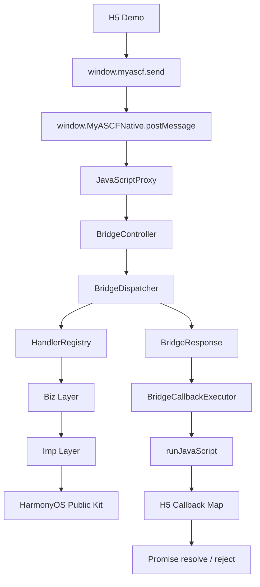
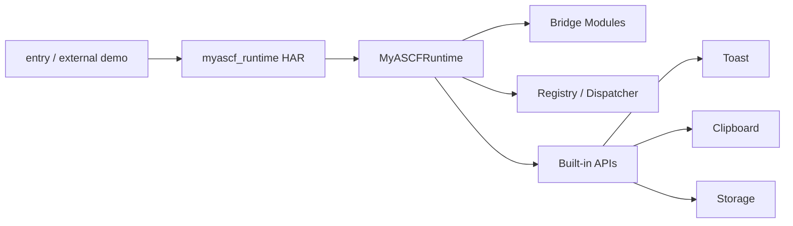
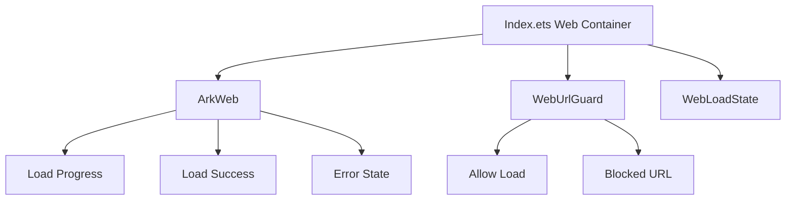

# MiniAppRuntime-Harmony

一个受小程序运行时架构启发的 HarmonyOS Web 容器与 JSBridge 框架。

MiniAppRuntime-Harmony 基于 HarmonyOS、ArkTS 与 ArkWeb，探索 H5 如何以 Promise 形式调用 ArkTS 能力，以及通信、分发、注册、参数校验、平台调用和异步回调如何组成清晰的运行时链路。

## 合规边界

本项目为个人开源学习与工程实践项目，完全基于公开 HarmonyOS、ArkTS 与 ArkWeb 能力实现。公开仓库仅包含自行编写的项目代码、示例和文档，不包含任何非公开实现或业务材料。

## 当前能力

- ArkWeb 加载本地 H5，展示加载进度和加载状态。
- `window.myascf.send(action, params, options?)` Promise 调用方式。
- requestId、callback map、TIMEOUT 与 CALLBACK_LOST。
- JavaScriptProxy 与 runJavaScript 双向通信。
- BridgeController、BridgeDispatcher、HandlerRegistry、RuntimeBootstrap。
- Biz / Imp 分层与 BridgeCallbackExecutor 统一回调。
- UNKNOWN_ACTION、PARAM_ERROR、INTERNAL_ERROR、PARSE_ERROR 等错误处理。
- Toast、Clipboard、Storage API。
- H5 DebugPanel 调用链路展示。
- `myascf_runtime` 本地 HAR 模块与 `MyASCFRuntime` 门面类。
- WebLoadState、URL Guard、白名单判断和错误状态页。
- API Manifest 与 `runtime.getApiList` 动态能力查询。

## Architecture







## 核心调用链

```text
H5 -> window.myascf.send -> JavaScriptProxy -> BridgeController
   -> BridgeDispatcher -> HandlerRegistry -> Biz -> Imp
   -> BridgeResponse -> BridgeCallbackExecutor -> runJavaScript
   -> H5 callback map -> Promise resolve / reject
```

新增 API 不需要修改 BridgeController 主链路，只需定义 action、实现 Biz/Imp，并在 RuntimeBootstrap 注册 handler。

## Local HAR

`entry` 是可运行示例，负责 ArkWeb、H5 Demo 和容器 UI；`myascf_runtime` 是本地 HAR，负责 JSBridge 主链路、API 注册、平台能力封装和容器公共模型。`MyASCFRuntime` 在 HAR 内组装 Registry、Dispatcher、CallbackExecutor、Controller 和 Native Proxy。

## Quick Start

1. 使用 DevEco Studio 打开仓库。
2. 执行依赖同步。
3. Clean 后 Rebuild `entry` 模块。
4. 在模拟器或真机运行应用。
5. 使用 H5 页面验证 Toast、Clipboard、Storage、错误处理和 URL Guard。

建议使用与工程配置匹配的 HarmonyOS SDK。Clipboard 读取能力需要根据当前 SDK 要求配置和验证权限。

## MyASCFRuntime 接入

`entry/oh-package.json5`：

```json5
{
  "dependencies": {
    "myascf_runtime": "file:../myascf_runtime"
  }
}
```

页面接入：

```ts
import { webview } from '@kit.ArkWeb';
import { MyASCFRuntime } from 'myascf_runtime';

@Entry
@Component
struct Index {
  private controller: webview.WebviewController = new webview.WebviewController();
  private runtime: MyASCFRuntime = new MyASCFRuntime(this.controller, getContext(this));

  build() {
    Column() {
      Web({ src: $rawfile('web/index.html'), controller: this.controller })
        .javaScriptProxy({
          object: this.runtime.getNativeProxy(),
          name: this.runtime.getProxyName(),
          methodList: this.runtime.getMethodList(),
          controller: this.controller
        })
        .width('100%')
        .height('100%')
    }
    .width('100%')
    .height('100%')
  }
}
```

Storage 使用 Preferences，因此当前构造函数需要 Context。完整接入步骤见 [新建 Demo 接入 HAR](docs/guide/create-demo-with-har.md)。

## 当前支持的 API

| Category | Action | Params | Response | Status |
| --- | --- | --- | --- | --- |
| UI | `ui.showToast` | `message: string` | `echoAction` | 已实现 |
| System | `system.clipboard.writeText` | `text: string` | `echoAction` | 已实现 |
| System | `system.clipboard.readText` | - | `echoAction, text` | 已实现 |
| System | `system.storage.setItem` | `key: string, value: string` | `echoAction, key, value` | 已实现 |
| System | `system.storage.getItem` | `key: string` | `echoAction, key, value` | 已实现 |
| System | `system.storage.removeItem` | `key: string` | `echoAction, key` | 已实现 |
| System | `system.storage.clear` | - | `echoAction` | 已实现 |
| Runtime | `runtime.getApiList` | - | `apis: ApiSummary[]` | 已实现 |

完整元信息由 HAR 内的 `BUILTIN_API_MANIFEST` 维护，文档入口见 [API 总览](docs/api/index.md)。

DebugPanel 通过 `runtime.getApiList` 动态读取该清单，不再维护单独的静态 action 列表。

```js
await window.myascf.send('ui.showToast', { message: 'hello from h5' });
await window.myascf.send('system.clipboard.writeText', { text: 'hello clipboard' });
const storageRes = await window.myascf.send('system.storage.getItem', { key: 'username' });
```

## Web Container

示例应用通过 ArkWeb 事件维护 `idle / loading / success / error / blocked` 状态，展示加载进度，在主页面失败或 URL 被拦截时显示可重试的错误状态。`WebUrlGuard` 当前提供轻量 scheme 与 host 白名单判断，不等同于完整安全沙箱。

## Project Structure

```text
entry/                         可运行 Demo、ArkWeb、rawfile H5
myascf_runtime/                本地 HAR 框架模块
  src/main/ets/bridge/         通信入口与回调执行
  src/main/ets/dispatcher/     action 分发
  src/main/ets/registry/       handler 注册
  src/main/ets/biz/            参数校验与响应语义
  src/main/ets/imp/            HarmonyOS 公开能力调用
  src/main/ets/container/      Web 容器配置、Guard、状态
docs/                          架构、指南、API、调试、阶段与博客
```

## Documentation

- [文档首页](docs/README.md)
- [项目介绍](docs/overview/project-introduction.md)
- [运行时架构](docs/architecture/runtime-architecture.md)
- [JSBridge 架构](docs/architecture/jsbridge-architecture.md)
- [HAR 模块设计](docs/architecture/har-module-design.md)
- [Web 容器设计](docs/architecture/web-container-design.md)
- [HAR 使用指南](docs/guide/har-usage.md)
- [新建 Demo 接入](docs/guide/create-demo-with-har.md)
- [调试指南](docs/debug/debug-guide.md)
- [API Manifest 设计](docs/architecture/api-manifest-design.md)
- [新增 API 指南](docs/guide/add-new-api.md)

## Blog Series

博客草稿与推荐发布顺序见 [docs/blogs/README.md](docs/blogs/README.md)。系列从 ArkWeb 本地 H5、JSBridge Promise、运行时分层讲到 HAR 模块化、Storage、Web 容器和面试表达。

## Screenshots

> TODO：后续补充以下真实运行截图，清单维护在 `docs/assets/screenshots/`。

- H5 Demo 首页
- Toast API 调用成功
- Clipboard write/read 调用成功
- Storage set/get 调用成功
- DebugPanel 调用链路
- Web 加载进度
- URL Guard 拦截状态
- Web 错误状态页

## Roadmap

- [x] ArkWeb 加载本地 H5
- [x] H5 -> ArkTS JavaScriptProxy 通信
- [x] requestId + Promise + callback map
- [x] BridgeDispatcher / HandlerRegistry
- [x] Biz / Imp 分层
- [x] Toast / Clipboard / Storage API
- [x] TIMEOUT / CALLBACK_LOST
- [x] H5 DebugPanel
- [x] runtime 本地 HAR 模块化与 MyASCFRuntime 门面
- [x] Web 容器加载进度、URL Guard 和错误状态
- [x] API Manifest、README API 表格和新增 API 模板
- [x] runtime.getApiList 动态查询
- [ ] 补充真实运行截图
- [ ] 发布博客系列
- [ ] API 文档自动生成
- [ ] Network API
- [ ] H5 SDK npm 化

## Highlights

- 用 requestId 与 callback map 管理跨端异步调用。
- 用 Dispatcher / Registry 把通信入口与 API 扩展解耦。
- 用 Biz / Imp 区分协议语义和平台调用。
- 用 CallbackExecutor 集中处理 runJavaScript 回调。
- 用本地 HAR 和门面类降低新 Demo 的接入成本。
- 用 ApiManifest 统一描述 action、参数、响应、错误和实现类。
- 同时覆盖 JSBridge、Web 容器状态、错误治理和调试展示。

面试讲解建议从“为什么不把 action 判断写进 Controller”切入，再依次讲协议、分发注册、Biz/Imp、回调治理、HAR 模块化和容器增强。

## License

当前仓库尚未提交独立 LICENSE 文件。在明确开源许可证前，请将代码用于学习、评审和交流；后续应补充正式许可证文件。
