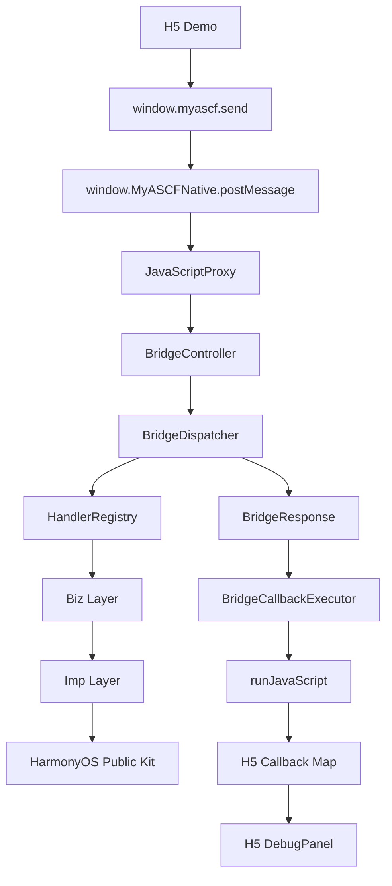

# MiniAppRuntime-Harmony

一个受小程序运行时架构启发的 HarmonyOS Web 容器与 JSBridge 框架。

MiniAppRuntime-Harmony 是一个基于 HarmonyOS / ArkTS / ArkWeb 的轻量级运行时框架 Demo，用于探索 H5 页面如何通过 JSBridge 调用 ArkTS 能力，并通过 Dispatcher、Registry、Biz/Imp 分层实现可扩展的 Native API 调用链路。

## 合规边界

本项目为个人开源学习与工程实践项目，基于公开 HarmonyOS / ArkTS / ArkWeb 能力实现，不包含任何公司内部源码、内部接口、内部文档或非公开实现。

## 当前能力

- ArkWeb 本地 H5 加载
- H5 Promise 形式调用 ArkTS
- JavaScriptProxy 通信边界
- BridgeController 请求解析
- BridgeDispatcher action 分发
- HandlerRegistry 能力注册
- RuntimeBootstrap 内置 API 注册
- ToastBiz / ToastImp
- ClipboardBiz / ClipboardImp
- BridgeCallbackExecutor
- TIMEOUT / CALLBACK_LOST
- UNKNOWN_ACTION / PARAM_ERROR / INTERNAL_ERROR
- H5 DebugPanel 调用链路展示
- runtime HAR 模块化：`myascf_runtime`
- HAR 门面类：`MyASCFRuntime`

## Architecture



## 核心调用链

`ui.showToast` 调用链：

```text
H5
-> window.myascf.send("ui.showToast", { message })
-> JavaScriptProxy
-> BridgeController
-> BridgeDispatcher
-> HandlerRegistry
-> ToastBiz
-> ToastImp
-> promptAction.showToast
-> BridgeCallbackExecutor
-> H5 Promise resolve
```

`system.clipboard.readText` 复用同一条主链路，只是在 Registry 中命中 Clipboard handler，最终通过 ClipboardBiz / ClipboardImp 调用公开剪贴板能力，并把文本放入 `BridgeResponse.data.text` 返回 H5。

## Quick Start

1. 使用 DevEco Studio 打开项目。
2. 执行 Sync / Build。
3. 运行 `entry` 模块。
4. 应用启动后，ArkWeb 会加载本地 H5 Demo。
5. 点击 Toast / Clipboard / Timeout / Unknown Action 按钮验证链路。

建议使用与项目 SDK 配置匹配的 HarmonyOS SDK 和模拟器或真机环境。首次打开后，如果本地 HAR 依赖未同步，请先执行 DevEco Studio 的依赖同步。

## HAR Usage

在新的 HarmonyOS Demo 中接入 `myascf_runtime` 时，entry 侧只需要创建 `WebviewController` 和 `MyASCFRuntime`：

```ts
import { webview } from '@kit.ArkWeb';
import { MyASCFRuntime } from 'myascf_runtime';

private controller: webview.WebviewController = new webview.WebviewController();
private runtime: MyASCFRuntime = new MyASCFRuntime(this.controller, getContext(this));
```

然后把 runtime 暴露给 ArkWeb：

```ts
Web({ src: $rawfile('web/index.html'), controller: this.controller })
  .javaScriptProxy({
    object: this.runtime.getNativeProxy(),
    name: this.runtime.getProxyName(),
    methodList: this.runtime.getMethodList(),
    controller: this.controller
  })
```

entry 不需要直接组装 `BridgeController`、`BridgeDispatcher`、`HandlerRegistry` 或 `RuntimeBootstrap`。

## Project Structure

```text
entry/
  src/main/ets/pages/Index.ets
  src/main/resources/rawfile/web/

myascf_runtime/
  src/main/ets/bridge/
  src/main/ets/dispatcher/
  src/main/ets/registry/
  src/main/ets/biz/
  src/main/ets/imp/
  src/main/ets/error/
  src/main/ets/logger/
  src/main/ets/Index.ets

docs/
  overview/
  architecture/
  stages/
  api/
  debug/
```

## Documentation

推荐阅读顺序：

1. [项目介绍](docs/overview/project-introduction.md)
2. [运行时架构](docs/architecture/runtime-architecture.md)
3. [JSBridge 架构](docs/architecture/jsbridge-architecture.md)
4. [HAR 模块设计](docs/architecture/har-module-design.md)
5. [ArkWeb 加载本地 H5](docs/stages/02-load-local-h5-with-arkweb.md)
6. [H5 到 ArkTS 通信边界](docs/stages/03-h5-to-arkts-javascript-proxy.md)
7. [Dispatcher 和 Registry](docs/stages/04-dispatcher-and-registry.md)
8. [Toast Biz/Imp](docs/stages/05-toast-biz-imp.md)
9. [runJavaScript 回调治理](docs/stages/06-runjavascript-callback.md)
10. [Clipboard API](docs/stages/07-clipboard-api.md)
11. [DebugPanel](docs/stages/08-debug-panel.md)
12. [Runtime HAR 抽取](docs/stages/09-extract-runtime-to-har.md)
13. [GitHub 展示文档](docs/stages/10-github-showcase.md)

## Screenshots

> TODO: 后续补充 H5 Demo、DebugPanel、Toast、Clipboard 调用截图。

## Roadmap

- [x] ArkWeb 加载本地 H5
- [x] H5 -> ArkTS JavaScriptProxy 通信
- [x] BridgeDispatcher / HandlerRegistry
- [x] ui.showToast
- [x] system.clipboard.writeText / readText
- [x] TIMEOUT / CALLBACK_LOST
- [x] DebugPanel
- [x] runtime HAR 模块化
- [ ] Storage API
- [ ] Network API
- [ ] Web 容器白名单与错误页
- [ ] 更完整的 API 文档生成

## Highlights

- 不是简单 WebView Demo，而是完整 JSBridge 调用链路。
- 使用 requestId + callback map 管理异步调用。
- 使用 Dispatcher / Registry 解耦 action 分发。
- 使用 Biz / Imp 分离参数校验和平台能力调用。
- 使用 CallbackExecutor 统一封装 runJavaScript。
- 支持 TIMEOUT / CALLBACK_LOST / UNKNOWN_ACTION / PARAM_ERROR。
- 通过 DebugPanel 可视化调用链路。
- 将 runtime 抽取为 HAR 模块，让 `entry` 更像示例应用，`myascf_runtime` 承载框架核心。
- 通过 `MyASCFRuntime` 封装 HAR 对外入口，降低 Demo 接入成本。
## Storage API

框架现支持 `system.storage.setItem`、`getItem`、`removeItem`、`clear`。Storage 基于 HarmonyOS Preferences；创建 HAR 门面时需传入 Context：

```ts
private runtime: MyASCFRuntime = new MyASCFRuntime(this.controller, getContext(this));
```

H5 调用示例：

```js
await window.myascf.send('system.storage.setItem', { key: 'username', value: 'lichenyang' });
const response = await window.myascf.send('system.storage.getItem', { key: 'username' });
```

详细协议见 [docs/api/storage.md](docs/api/storage.md)。
## Web Container

HAR 提供 `WebContainerConfig`、`WebUrlGuard` 和 `WebLoadState`，示例应用展示加载进度、URL 白名单拦截、加载错误状态与重试入口。容器事件统一写入 `RuntimeLogger`，不改变现有 JSBridge 协议。

默认规则允许本地 rawfile；远程 HTTP(S) 页面必须同时命中 scheme 与 host 白名单。详细设计见 [Web Container Design](docs/architecture/web-container-design.md)。
