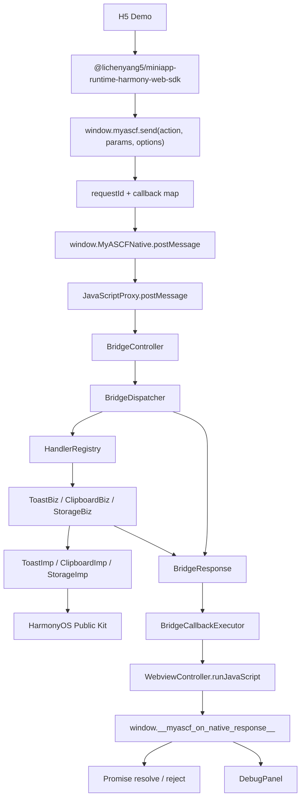

# JSBridge 架构

这篇文档解决的问题：说明 H5 与 ArkTS 如何通信、请求响应协议如何设计、为什么要有 Dispatcher / Registry / Biz / Imp / CallbackExecutor，以及 DebugPanel 如何帮助观察链路。

## 当前链路



当前 ArkTS runtime 核心代码位于 `myascf_runtime` HAR，H5 调用侧位于 `h5_sdk`，`entry` 只负责 ArkWeb 容器、SDK 产物集成和 H5 Demo。

entry 侧通过 `MyASCFRuntime` 接入 HAR，不再直接创建 BridgeController、BridgeDispatcher、HandlerRegistry 或 RuntimeBootstrap。

## 请求协议

H5 调用：

```js
window.myascf.send('ui.showToast', { message: 'hello' })
```

发送给 ArkTS 的 JSON：

```json
{
  "requestId": "string",
  "action": "ui.showToast",
  "params": {
    "message": "hello"
  }
}
```

字段含义：

- `requestId`：H5 生成，用于匹配异步回调。
- `action`：能力名称，例如 `ui.showToast`。
- `params`：API 参数，由 Biz 层校验。

## 响应协议

ArkTS 回调 H5 的 JSON：

```json
{
  "requestId": "string",
  "code": 0,
  "message": "success",
  "data": {}
}
```

H5 根据 `requestId` 找到 callback map 中的 Promise callback。如果 `code === 0`，Promise resolve；否则 Promise reject。

## H5 Callback Map

H5 侧维护一个 callback map：

```js
var callbacks = new Map();
```

每次调用 `send` 时保存：

- requestId
- resolve
- reject
- timer
- action
- params

这样可以支持并发调用、异步回调、timeout 和 callback lost。

上述能力现由 `h5_sdk` 的 TypeScript 源码维护，rawfile 中的 `myascf.js` 是构建后同步产物。设计细节见 [H5 SDK 设计](h5-sdk-design.md)。

## 为什么要有 Dispatcher / Registry

如果直接在 BridgeController 里写：

```text
if action == ui.showToast
else if action == system.clipboard.readText
```

API 越多，Controller 越难维护。Dispatcher / Registry 把问题拆开：

- Dispatcher：只负责分发和统一错误处理。
- Registry：只负责 action 与 handler 的注册、查询。
- Biz / Imp：只负责具体 API。

这让新增 API 的成本变成“新增 handler 并注册”，而不是修改通信入口。

## 为什么要有 Biz / Imp

Biz 和 Imp 解决的是“协议校验”和“平台调用”不要混在一起。

```text
ToastBiz
-> 校验 message
-> ToastImp
-> promptAction.showToast
```

```text
ClipboardBiz
-> 校验 text 或组装 readText 响应
-> ClipboardImp
-> pasteboard
```

```text
StorageBiz
-> 校验 key / value 并组装响应
-> StorageImp
-> Preferences
```

Biz 面向 JSBridge 协议，Imp 面向 HarmonyOS 公开 Kit。

## 为什么要有 BridgeCallbackExecutor

ArkTS 返回 H5 需要执行：

```js
window.__myascf_on_native_response__(responseText)
```

这个过程涉及 JSON 字符串转义、runJavaScript 调用和异常日志。如果散落在 Controller 或 Biz 中，后续很难统一治理。BridgeCallbackExecutor 让回调出口集中、稳定。

## 错误链路

当前基础错误包括：

- `PARAM_ERROR`
- `UNKNOWN_ACTION`
- `INTERNAL_ERROR`
- `TIMEOUT`
- `CALLBACK_LOST`
- `PARSE_ERROR`

ArkTS 负责返回标准 `BridgeResponse`，H5 负责 timeout 和 callback lost 的 Promise 行为。

## DebugPanel

DebugPanel 记录 H5 侧调用生命周期：

```text
recordStart
recordEnd
recordError
recordLost
```

它展示最近 20 条记录，适合 GitHub 展示、调试截图和面试讲解。DebugPanel 不改变请求/响应协议。

## 当前尚未实现

- Network API。
- H5 SDK npm 化。
- 从 API Manifest 自动生成逐 action 类型。
- 更完整的 DebugPanel 搜索、筛选和耗时统计。
