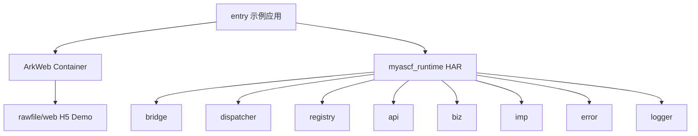

# 运行时架构

这篇文档解决的问题：说明 MiniAppRuntime-Harmony 的工程结构、HAR 模块化后的职责边界，以及每一层为什么独立存在。

## 总览



`entry` 负责把 Demo 跑起来，`myascf_runtime` 负责让 JSBridge 调用链路可复用。这样做的好处是：Demo 页面可以变化，但 runtime 核心不需要跟着页面一起散落在应用代码里。

## 当前工程结构

```text
ArkMiniRuntime/
  AppScope/
  build-profile.json5
  oh-package.json5
  entry/
    src/main/ets/entryability/
    src/main/ets/pages/Index.ets
    src/main/resources/rawfile/web/
  myascf_runtime/
    src/main/ets/bridge/
    src/main/ets/dispatcher/
    src/main/ets/registry/
    src/main/ets/api/
    src/main/ets/biz/
    src/main/ets/imp/
    src/main/ets/error/
    src/main/ets/logger/
    src/main/ets/Index.ets
  docs/
```

## entry 负责什么

`entry` 是示例应用层：

- 创建 `webview.WebviewController`。
- 创建 `MyASCFRuntime` 门面。
- 通过 ArkWeb 加载 `$rawfile('web/index.html')`。
- 使用 `runtime.getNativeProxy()`、`runtime.getProxyName()`、`runtime.getMethodList()` 注册 `.javaScriptProxy(...)`。
- 放置 H5 Demo、按钮和 DebugPanel。

`entry` 不负责 action 分发、不直接校验 API 参数、不直接调用 Toast 或 Clipboard。这样可以避免 Web 页面越来越厚。

## myascf_runtime 负责什么

`myascf_runtime` 是 HAR runtime 模块：

- `bridge/`：连接 ArkWeb 与 H5，包含 JavaScriptProxy、BridgeController、BridgeCallbackExecutor。
- `dispatcher/`：统一分发 action，处理 UNKNOWN_ACTION 和内部异常。
- `registry/`：注册和查询 action handler。
- `api/`：维护 action 常量和 Bridge 请求/响应协议类型。
- `biz/`：做参数校验和业务编排。
- `imp/`：调用公开 HarmonyOS Kit。
- `error/`：统一错误码和错误对象。
- `logger/`：统一 ArkTS 侧日志。

## 为什么不能把所有逻辑写在 BridgeController

BridgeController 是通信入口，职责应该是“接收、解析、交给分发器”。如果把 action 判断、参数校验、系统 API 调用和回调拼接都写在这里，会带来几个问题：

- 每新增一个 API 都要改 Controller。
- Controller 会同时懂通信、业务、系统能力和错误处理。
- 参数错误、未知 action、内部异常难以统一。
- H5 回调脚本拼接容易散落，后续维护风险高。

所以当前拆分为 Controller -> Dispatcher -> Registry -> Biz -> Imp -> CallbackExecutor。

在 HAR 对外接入层，entry 不直接组装这些对象，而是通过 `MyASCFRuntime` 完成内部依赖创建。

## 为什么要有 Dispatcher / Registry

Dispatcher 负责“根据 action 找 handler 并执行”，Registry 负责“保存 action 与 handler 的对应关系”。两者分开后：

- action 扩展变成注册行为。
- UNKNOWN_ACTION 可以统一处理。
- Controller 不需要知道有哪些 API。
- 后续可以做白名单、权限、统计或拦截。

## 为什么要有 Biz / Imp

Biz 层负责参数校验和响应结构，Imp 层负责调用平台公开能力。

以 `ui.showToast` 为例：

```text
ToastBiz
-> 校验 params.message
-> ToastImp.showToast
-> promptAction.showToast
-> BridgeResponse
```

这样做可以避免系统 API 调用和参数协议混在一起，也方便后续为同一个 API 增加更多校验规则。

## 为什么抽出 BridgeCallbackExecutor

ArkTS 回调 H5 需要通过 `WebviewController.runJavaScript` 执行脚本，并且要处理 JSON 字符串转义。把它抽成 BridgeCallbackExecutor 后：

- Controller 不直接拼接 JS。
- 回调格式集中管理。
- CALLBACK_LOST 风险可以统一记录。
- 后续可以增加回调耗时统计。

## DebugPanel 的作用

DebugPanel 是 H5 Demo 内的轻量可视化面板，用来展示最近 20 条调用记录，包括 requestId、action、status、code、message、duration、params 和 response。

它不改变 JSBridge 协议，只帮助演示和排查链路。

## 当前已实现

- ArkWeb 加载本地 H5。
- JavaScriptProxy 通信边界。
- requestId、callback map、Promise、timeout、callback lost。
- BridgeDispatcher / HandlerRegistry。
- Toast 和 Clipboard 两组真实 API。
- BridgeCallbackExecutor。
- H5 DebugPanel。
- runtime HAR 模块化。
- MyASCFRuntime 统一对外入口。

## 当前尚未实现

- Storage API。
- Network API。
- Web 容器白名单与错误页。
- 更完整的 DebugPanel 搜索、筛选和统计。
