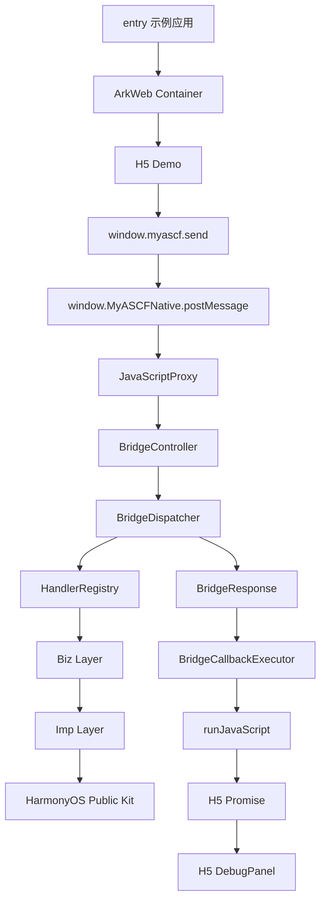

# Architecture Overview

这篇文档解决的问题：提供一份可直接复制到 README、博客或演示材料中的 Mermaid 架构图。

## 讲解顺序

1. `entry` 只是示例应用。
2. H5 通过 `window.myascf.send` 发起请求。
3. JavaScriptProxy 把请求交给 ArkTS。
4. Dispatcher / Registry 决定由哪个 handler 处理。
5. Biz 校验参数，Imp 调用公开 HarmonyOS Kit。
6. BridgeCallbackExecutor 统一回调 H5。
7. DebugPanel 展示调用状态。
