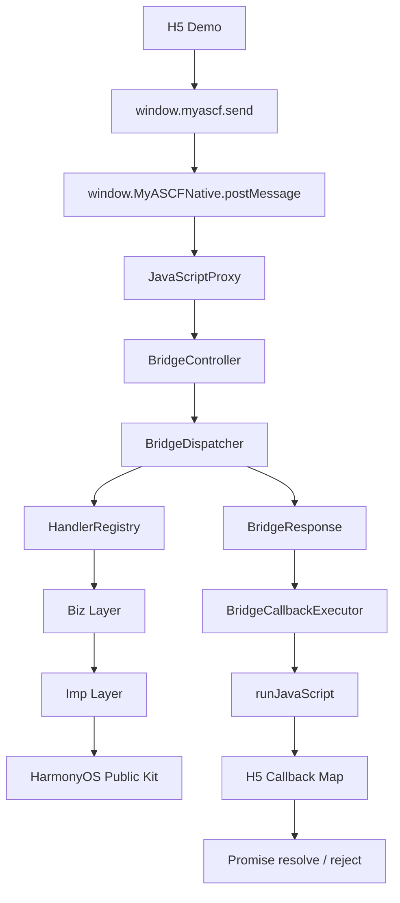
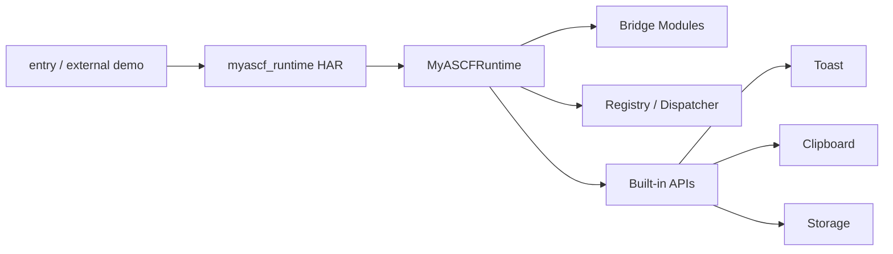
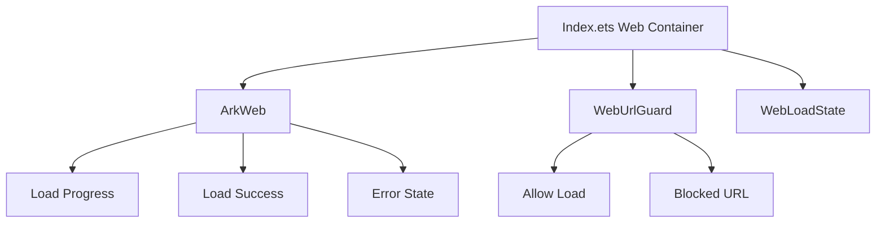

# 架构图汇总

这篇文档解决什么问题：集中保存项目 Mermaid 图，便于 GitHub 阅读、博客引用和后续导出图片。

## JSBridge 主链路

```mermaid
flowchart TD
  H5["H5 Demo"] --> Send["window.myascf.send"]
  Send --> Native["window.MyASCFNative.postMessage"]
  Native --> JSP["JavaScriptProxy"]
  JSP --> BC["BridgeController"]
  BC --> BD["BridgeDispatcher"]
  BD --> HR["HandlerRegistry"]
  HR --> Biz["Biz Layer"]
  Biz --> Imp["Imp Layer"]
  Imp --> Kit["HarmonyOS Public Kit"]
  BD --> Resp["BridgeResponse"]
  Resp --> CB["BridgeCallbackExecutor"]
  CB --> RunJS["runJavaScript"]
  RunJS --> Callback["H5 Callback Map"]
  Callback --> Promise["Promise resolve / reject"]
```

## HAR 模块关系

```mermaid
flowchart LR
  Demo["entry / external demo"] --> HAR["myascf_runtime HAR"]
  HAR --> Runtime["MyASCFRuntime"]
  Runtime --> Bridge["Bridge Modules"]
  Runtime --> Registry["Registry / Dispatcher"]
  Runtime --> Api["Built-in APIs"]
  Api --> Toast["Toast"]
  Api --> Clipboard["Clipboard"]
  Api --> Storage["Storage"]
```

## Web 容器

```mermaid
flowchart TD
  Entry["Index.ets Web Container"] --> Web["ArkWeb"]
  Entry --> Guard["WebUrlGuard"]
  Entry --> State["WebLoadState"]
  Guard --> Allow["Allow Load"]
  Guard --> Block["Blocked URL"]
  Web --> Progress["Load Progress"]
  Web --> Success["Load Success"]
  Web --> Error["Error State"]
```

这些图只描述当前仓库已经实现的结构，不表示完整小程序平台或生产级容器。
