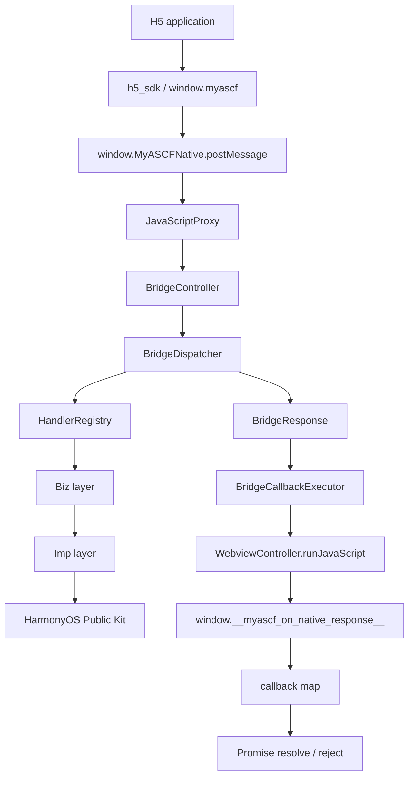

# Runtime Architecture Diagram

这篇文档解决什么问题：用一张可复用的 Mermaid 图说明 H5 请求如何进入 ArkTS runtime、调用公开 HarmonyOS 能力并回到 Promise。

## 源码对应

| 图中层级 | 主要目录 |
| --- | --- |
| H5 SDK | `h5_sdk/src/` |
| Bridge | `myascf_runtime/src/main/ets/bridge/` |
| Dispatcher | `myascf_runtime/src/main/ets/dispatcher/` |
| Registry / Bootstrap | `myascf_runtime/src/main/ets/registry/` |
| Biz / Imp | `myascf_runtime/src/main/ets/biz/`、`imp/` |
| Demo container | `entry/src/main/ets/pages/` |

该图描述当前实现，不代表完整小程序平台或生产级安全沙箱。
